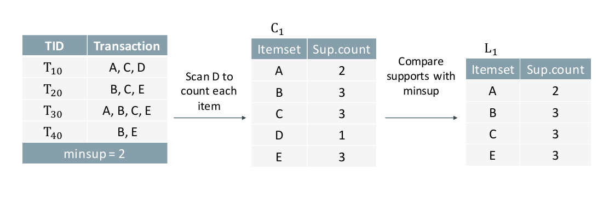
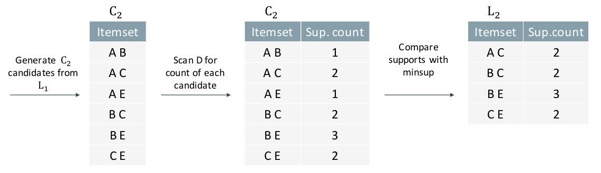
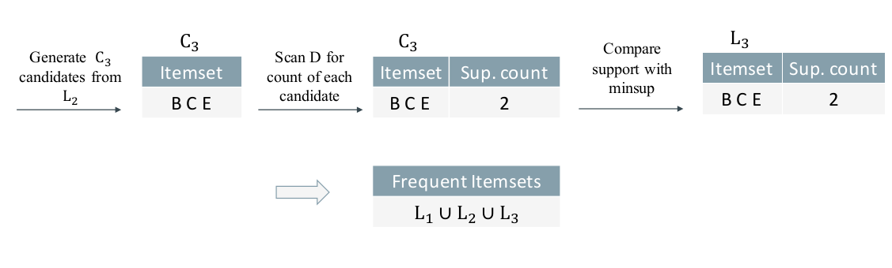
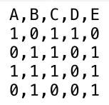
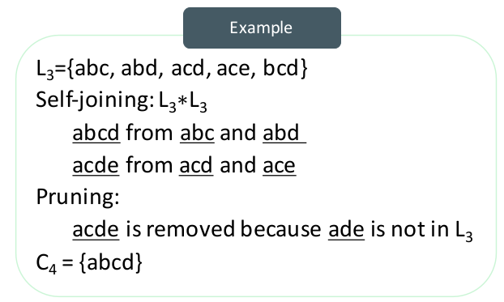
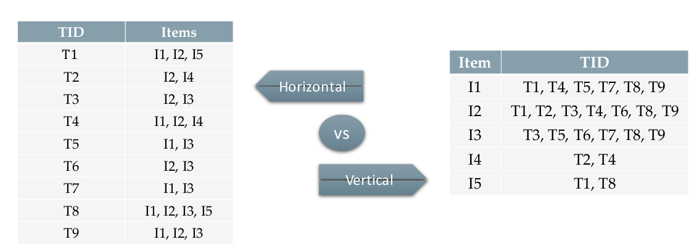

# Kick Start

## Major Tasks in Data Mining
- description
- prediction
- regression
- clustering
- classification
- association

---
## Frequent Pattern Mining
Going to find frequent pattern in our data

#### I. Frequent Pattern Mining
1. Definition
2. Application
3. Concepts

#### II. Methods
1. Apriori Algorithm
2. Improving Apriori Efficiency
3. ECLAT Algorithm

#### III. Association Rule
1. Support and Confidence
2. Mining Association Rules
3. Correlation Measures

---
### Basic Concepts
-  <b>Itemset</b>: A set of items
-  <b>k-itemset</b>: An itemset with k items.
-  <b>Support count</b>: Number of transactions that contain an itemset
-  <b>Support ratio</b>: Fraction of transactions that contain an itemset
-  <b>Frequent itemset</b>: An itemset whose support is greater than or equal to a minsup threshold

---
### Lets Find Frequent Patterns

• Brute-force approach:
- Each itemset in the lattice is a candidate frequent itemset
- Count the support of each candidate by scanning the database
- Match each transaction against every candidate
- Complexity ~ O(NMw) => Expensive since M = 2^d (M is the length of candidates)

### Apriori Algorithm
(Input: DB, minsup)
1. Initially, scan DB once to get frequent 1-itemset
2. Set k=1
3. Generate length (k+1) candidate itemsets from length k frequent itemsets
4. Test the candidates against DB to get frequent (k+1)-itemsets
5. k += 1
6. Terminate when no frequent or candidate set can be generated

In this way, we makes something like bellow table
 

#### How to Generate Candidates?
1. Self joining L(k-1): C(k) is generated by
joining L(k-1) with itself
2. Pruning: Any (k-1)-itemset that is
not frequent cannot be a subset of a
frequent k-itemset: The apriori
prunning principle

- C(k) : Candidate itemset of size k
- L(k) : frequent itemset of size k

### Methods to Improve Apriori’s Efficiency
- <b>Sampling:</b>
Mining on a subset of given data with a lower support threshold
- <b>Transaction reduction:</b>
A transaction that does not contain any frequent k-itemset is useless in subsequent scans
- <b>Direct hashing:</b>
A k-itemset whose corresponding hashing bucket count is below the threshold cannot be frequent
- <b>Partitioning:</b>
Any itemset that is potentially frequent in DB must be frequent in at least one of the partitions of DB
- <b>Data Format</b>
    - Horizontal: document → words
    - Vertical: words → document

### Eclat Algorithm(Equivalence Class Transformation)
Is similar to Apriori, but uses the vertical data format.

Besides taking advantage of the Apriori property in the generation of candidate (k+1)-itemsets from frequent k-itemsets, there is no need to scan the database to find the supports of candidate (k+1)-itemsets. This is because the TID list of each k-itemset carries the complete information required for counting such supports.

`to get more optimal try "Max-Itemsets" and "Closed Frequent Itemsets" methods`

---

### Association Rules
An expression of the form X → Y, where X and Y are nonempty disjoint itemsets (X ≠ ∅, Y ≠ ∅, X ∩ Y = ∅)

Given a set of transactions T, the goal of association rule mining is to find all strong rules having:
- support ≥ minsup threshold
    - Fraction of transactions that contain both A and B
        - Support(A → B) = Support(A ∪ B) = Support(B → A)
- confidence ≥ minconf threshold
    - How often B appears in transactions that contain A
        - Confidence(A → B) = Support (A ∪ B)/Support (A)

`Support measures the coverage of the rule. Confidence measures the accuracy of the rule.`

#### Association Rule Mining
- Brute-force approach(impractical)
    - List all possible association rules
    - Compute the support and confidence for each rule
    - Prune rules that fail the minsup and minconf thresholds
- Use the frequent itemsets
    - Generate all itemset with support ≥ minsup
    - Generation high confidence rules from each frequent itemset, where each rule is a binary partitioning of a frequent itemset

#### Lift
Strong Rules are not necessarily interesting. We need more measures to evaluate rules.