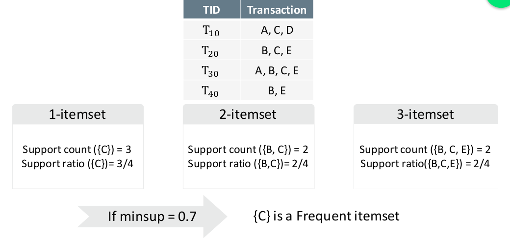

# Kick Start

## Major Tasks in Data Mining
- description
- prediction
- regression
- clustering
- classification
- association

---
## Frequent Pattern Mining
Going to find frequent pattern in our data

#### I. Frequent Pattern Mining
1. Definition
2. Application
3. Concepts

#### II. Methods
1. Apriori Algorithm
2. Improving Apriori Efficiency
3. ECLAT Algorithm

#### III. Association Rule
1. Support and Confidence
2. Mining Association Rules
3. Correlation Measures

---
### Basic Concepts
-  <b>Itemset</b>: A set of items
-  <b>k-itemset</b>: An itemset with k items.
-  <b>Support count</b>: Number of transactions that contain an itemset
-  <b>Support ratio</b>: Fraction of transactions that contain an itemset
-  <b>Frequent itemset</b>: An itemset whose support is greater than or equal to a minsup threshold

---
### Lets Find Frequent Patterns

• Brute-force approach:
- Each itemset in the lattice is a candidate frequent itemset
- Count the support of each candidate by scanning the database
- Match each transaction against every candidate
- Complexity ~ O(NMw) => Expensive since M = 2^d (M is the length of candidates)

### Apriori Algorithm