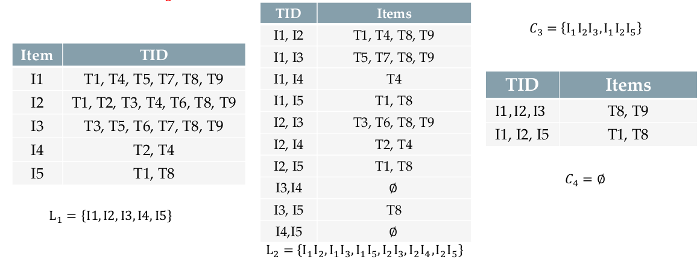
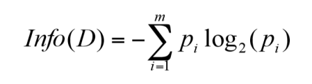
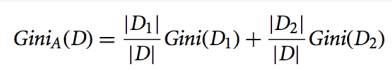

# Kick Start

## Major Tasks in Data Mining
- description
- prediction
- regression
- clustering
- classification
- association

---
## Frequent Pattern Mining
Going to find frequent pattern in our data

#### I. Frequent Pattern Mining
1. Definition
2. Application
3. Concepts

#### II. Methods
1. Apriori Algorithm
2. Improving Apriori Efficiency
3. ECLAT Algorithm

#### III. Association Rule
1. Support and Confidence
2. Mining Association Rules
3. Correlation Measures

---
### Basic Concepts
-  <b>Itemset</b>: A set of items
-  <b>k-itemset</b>: An itemset with k items.
-  <b>Support count</b>: Number of transactions that contain an itemset
-  <b>Support ratio</b>: Fraction of transactions that contain an itemset
-  <b>Frequent itemset</b>: An itemset whose support is greater than or equal to a minsup threshold

---
### Lets Find Frequent Patterns


• Brute-force approach:
- Each itemset in the lattice is a candidate frequent itemset
- Count the support of each candidate by scanning the database
- Match each transaction against every candidate
- Complexity ~ O(NMw) => Expensive since M = 2^d (M is the length of candidates)

### Apriori Algorithm
(Input: DB, minsup)
1. Initially, scan DB once to get frequent 1-itemset
2. Set k=1
3. Generate length (k+1) candidate itemsets from length k frequent itemsets
4. Test the candidates against DB to get frequent (k+1)-itemsets
5. k += 1
6. Terminate when no frequent or candidate set can be generated


In this way, we makes something like bellow table
 

#### How to Generate Candidates?
1. Self joining L(k-1): C(k) is generated by
joining L(k-1) with itself
2. Pruning: Any (k-1)-itemset that is
not frequent cannot be a subset of a
frequent k-itemset: The apriori
prunning principle

- C(k) : Candidate itemset of size k
- L(k) : frequent itemset of size k


### Methods to Improve Apriori’s Efficiency
- <b>Sampling:</b>
Mining on a subset of given data with a lower support threshold
- <b>Transaction reduction:</b>
A transaction that does not contain any frequent k-itemset is useless in subsequent scans
- <b>Direct hashing:</b>
A k-itemset whose corresponding hashing bucket count is below the threshold cannot be frequent
- <b>Partitioning:</b>
Any itemset that is potentially frequent in DB must be frequent in at least one of the partitions of DB
- <b>Data Format</b>
    - Horizontal: document → words
    - Vertical: words → document


### Eclat Algorithm(Equivalence Class Transformation)
Is similar to Apriori, but uses the vertical data format.



Besides taking advantage of the Apriori property in the generation of candidate (k+1)-itemsets from frequent k-itemsets, there is no need to scan the database to find the supports of candidate (k+1)-itemsets. This is because the TID list of each k-itemset carries the complete information required for counting such supports.

`to get more optimal try "Max-Itemsets" and "Closed Frequent Itemsets" methods`

---

### Association Rules
An expression of the form X → Y, where X and Y are nonempty disjoint itemsets (X ≠ ∅, Y ≠ ∅, X ∩ Y = ∅)

Given a set of transactions T, the goal of association rule mining is to find all strong rules having:
- support ≥ minsup threshold
    - Fraction of transactions that contain both A and B
        - Support(A → B) = Support(A ∪ B) = Support(B → A)
- confidence ≥ minconf threshold
    - How often B appears in transactions that contain A
        - Confidence(A → B) = Support (A ∪ B)/Support (A)

`Support measures the coverage of the rule. Confidence measures the accuracy of the rule.`

#### Association Rule Mining
- Brute-force approach(impractical)
    - List all possible association rules
    - Compute the support and confidence for each rule
    - Prune rules that fail the minsup and minconf thresholds
- Use the frequent itemsets
    - Generate all itemset with support ≥ minsup
    - Generation high confidence rules from each frequent itemset, where each rule is a binary partitioning of a frequent itemset


#### Lift
Strong Rules are not necessarily interesting. We need more measures to evaluate rules.


---
## Classification and Regression

- <b>Classification:</b> Predicts categorical class labels
(discrete or nominal).
    - Example: What is the weather
status tomorrow (rainy, cloudy,
sunny)?
- <b>Regression:</b> Models continuous-valued
functions.
    - Example: What is the temperature
going to be tomorrow?

### Type of Classification

1. Binary classification: 
Classification tasks with only two classes, typically denoted by {+,−}, {+1,−1}, or {Pos, Neg}. Example: email spam detection, (pos/neg) sentiment analysis.

2. Multiclass classification: 
Classification tasks with more than two classes. Example: email topic detection, (pos/null/neg) sentiment analysis.

### Classification algorithms
- Decision tree
- Bayesian methods (Naïve Bayes and Bayesian networks)
- K-Nearest Neighbors (KNN)
- Logistic regression
- Support Vector Machines (SVM)
- Artificial neural networks and Deep learning
- Ensemble learning
- And many more...


#### Decision Tree
There are many specific decision-tree algorithms, such as: 
- ID3 (Iterative Dichotomiser 3)
- C4.5 (successor of ID3)
- CART (Classification And Regression Tree)
- CHAID (CHi-squared Automatic Interaction Detector)
- MARS (extends decision trees to handle numerical data better)

`Basic algorithm adopted by ID3, C4.5 and CART is a greedy algorithm.`

Tree is constructed in a top-down recursive divide-and-conquer manner:
- At start, all the training tuples are at the root.
- Attributes are selected on the basis of a heuristic or statistical
measure (e.g., information gain).
- Tuples are partitioned recursively based on selected attributes.
- When an stopping condition is met, one leaf is constructed.
    1. All samples for a given node belong to the same class.
    2. There are no remaining attributes for further partitioning – majority voting is employed.
    3. There are no samples left – majority voting on the parent’s samples is employed

#### Attribute selection measures

An attribute selection measure (splitting rule) is a heuristic for selecting the splitting criterion that “best” separates a given data partition D. Ideally
- Each resulting partition would be pure (containing tuples that all belong to the
same class).
- Provide ranking for each attribute and the attribute with highest score is chosen.
- It can also determine a split point for continuous-valued attributes or a splitting subset for binary trees.

We’ll review Information Gain, Gain Ratio, and Gini Index.

##### Information Gain
Information entropy is a concept from information theory. It tells how much information there is in an event. In general, the more uncertain or random the event is, the more information it will contain.


We like #Low_Entropy

- High Entropy
    - is from a uniform like distribution (flat
histogram)
    - Values sampled from it are less predictable
- Low Entropy
    - X is from a varied distribution (histogram
has many lows and highs)
    - Values sampled from it are more predictable



```
m: the number of classes
pi: the probability that an arbitrary tuple in D belongs to class `Ci` estimated by:
|Ci,D|/|D|(proportion of tuples of each class)
```
A log function to the base 2 is used because the information is encoded in bits


```
- Suppose that we want to partition the tuples in D on some attribute A with
values {A1,A2, ..., Av}
- D is split into v partitions {D1, D2, ..., Dv}
```
|Dj|/|D|: the weight of the Jth partition.


`The attribute with the highest information gain is chosen as the splitting attribute.`


#### Gain Ratio
- Information gain measure is biased towards attributes with a large number of values.
    - For example, it prefers features like student_number which is not a useful feature in classification at all.
- C4.5 (a successor of ID3) uses gain ratio to overcome this problem (normalization of information gain).


#### Gini Index
- The Gini index is used in CART and measures the impurity of a dataset.

- If a data set D contains examples from n classes, gini(D) is defined as:


`where Pj is the relative frequency of class j in D.`

- If a data set D is split on A into two subsets D1 and D2 , the gini(A) D is defined as:



---
This document missed bellow topic notes:
- Pruning(pre-post)
- Bayesian Method
- K-Nearest Neighbors(KNN)
- Logistic Regression
- Support Vector Machine (SVM)
- Ensemble Learning

---

### Evaluation
- To compare different models.
- To tune the hyperparameters such as K in KNN, number of layers in neural networks, the best pruning of a decision tree, etc.
- The main goal of ML is generalization. We want to measure the generalization ability of our model.
- Hold-out method: You train on the training data and evaluate your model on the validation data. Once your model is ready, you test it one final time on the test data.
- Shuffle data before splitting.


#### K-fold cross validation
- When you have few data points, the validation set would end up being very small. This would prevent you from reliably evaluating your model. So, we use k-fold cross validation.
- Typical values for k: 5, 10, N (leave-one-out method).


#### Confusion Matrix
TP: True Positive
TN: True Negative
FP: False Positive (type I error)
FN: False Negative (Type II error)


#### Accuracy
percentage of tuples that are correctly classified

`(TP + TN) / (TP + FP + TN + FN)`

- Is it always a good measure?
    - Consider a cancer detection system always predicts “no cancer”
- Not a good measure for imbalanced data.


#### Precision
What percentage of tuples that the classifier labeled as positive are actually positive?


#### Recall:
What percentage of positive tuples did the classifier label as positive?


The most popular way is by harmonic mean: F-measure

